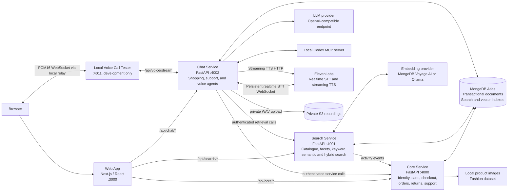
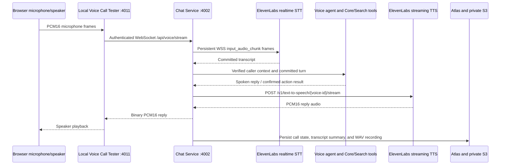

# Codex Ecommerce Demo Architecture

## Runtime Topology

## Service Ownership

| Component | Owns | Collaborates with |
| --- | --- | --- |
| Web App | Ecommerce UI, browser session experience, app-local API proxies | Core, Search, Chat |
| Core Service | Authentication, users, carts, checkout, orders, returns, tickets, images, activity/audit records | MongoDB Atlas; receives trusted calls from Search and Chat |
| Search Service | Catalogue filters, facets, keyword, semantic, hybrid, and similar-product search | MongoDB Atlas; embedding provider; Core activity API |
| Chat Service | Shopping/support sessions, LLM routing, Codex MCP, agent tools, local voice support, recordings/transcripts | Core, Search, MongoDB Atlas, ElevenLabs, S3 |

## Local Voice Call Flow

## Security Boundaries

- Browser traffic is routed through the Next.js app-local proxy; service credentials remain server-side.
- Core owns ecommerce writes. Search reports activity to Core, and Chat calls Core/Search using internal service tokens.
- The local voice stream is limited to development and requires a WebSocket token. The browser relay keeps that token server-side.
- ElevenLabs credentials, LLM credentials, Atlas credentials, and S3 credentials are read from server environment variables only.
- Voice recordings are stored privately; the admin surface exposes recording status, not the bucket, key, caller number, raw audio, or provider secrets.